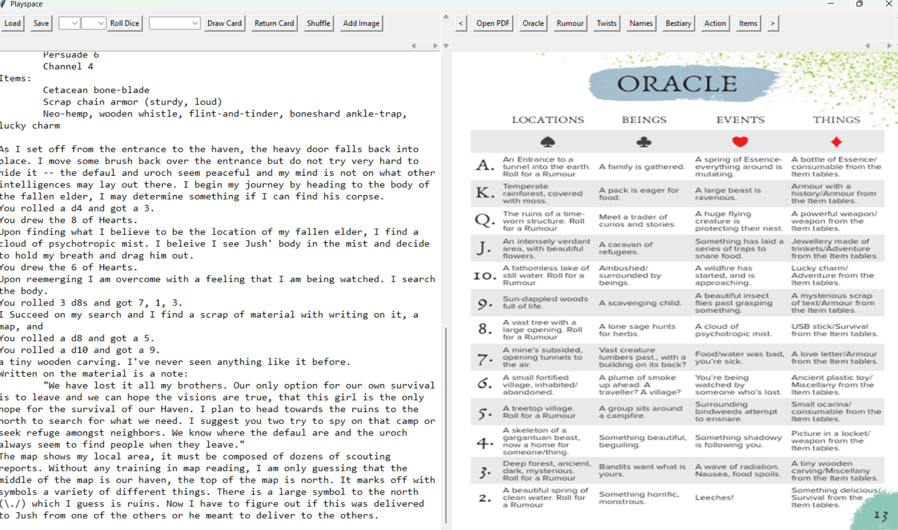

# SoloPDFPlayer
A simple python project for running writing-focused solo ttrpgs with the PDF, tools, and notepad in one window. 

Just running the python file will open a TKinter window. It is pretty easy to customize for each RPG, it includes some of the general tools, like rolling dice and drawing cards. The specific buttons for navigating the PDF are defined by a python dictionary at the top of the py file which is easy enough to change. Do not hesitate to steal or modify. Right now I have it running the Lone Eons ruleset and PDF from the Lost Eons game (which I recommend checking out! [https://davidblandy.itch.io/lost-eons])
